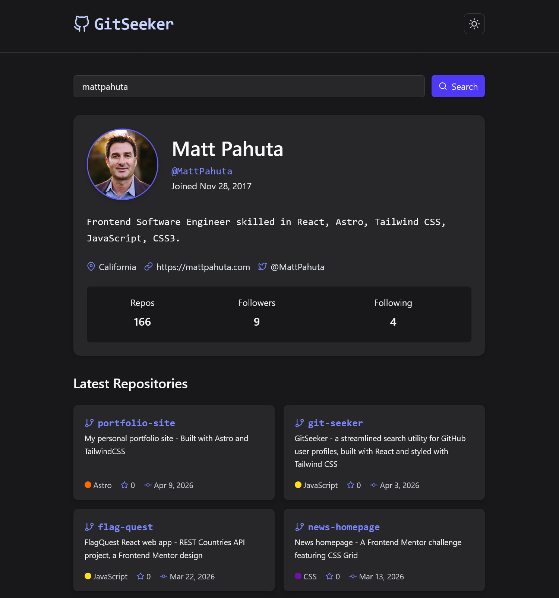

# GitSeeker - GitHub user search

A responsive GitHub profile search app built with React and Tailwind CSS, based on the [Frontend Mentor GitHub user search app challenge](https://www.frontendmentor.io/challenges/github-user-search-app-Q09YOgaH6). Search GitHub by username to view profile details and recent repositories.




## Table of Contents

- [Overview](#overview)
  - [Features](#features)
  - [Links](#links)
  - [Tech Stack](#tech-stack)
  - [Project Structure](#project-structure)
- [Architecture & Key Decisions](#architecture--key-decisions)
  - [Component Design](#component-design)
  - [State Management](#state-management)
  - [Custom Hook: useGitHubSearch](#custom-hook-usegithubsearch)
  - [API Layer](#api-layer)
  - [Utility Functions](#utility-functions)
  - [Theme System](#theme-system)
  - [Accessibility](#accessibility)
- [Data Flow](#data-flow)
- [Author](#author)


## Overview

GitSeeker was built as a solution to the associated Frontend Mentor challenge (with updated styling), providing a streamlined utility to search for GitHub user profiles, as well as an opportunity to continue practicing developing with modern React patterns. The app consumes the public [GitHub REST API](https://docs.github.com/en/rest) — no authentication required.


### Features

- Search any public GitHub profile by username
- Display profile details: avatar, name, bio, join date, location, website, email
- Display user's follower, following, and public repository counts
- Responsive grid of the user's 6 most recently updated repositories
- Light and dark theme toggle
- Navigable by keyboard with screen reader support throughout

### Links

- [live demo site](https://git-seeker.netlify.app/)


### Tech Stack

| Tool | Purpose |
|---|---|
| [React](https://react.dev/) | UI library |
| [Tailwind CSS](https://tailwindcss.com/) | Utility-first styling |
| [GitHub REST API](https://docs.github.com/en/rest) | Data source |
| [Vite](https://vitejs.dev/) | Build tool and dev server |
| [Feather](https://feathericons.com/) | Icon library for consistent design |

No external component libraries or state management packages used. UI built from scratch with inspiration from Frontend Mentor design. State management and data handling using native React tools and modern JavaScript.


### Project Structure

```
src/
├── App.jsx                   # Root component: theme + layout
│
├── hooks/
│   └── useGitHubSearch.js    # Custom hook: GitHub API fetch logic
│
├── components/
│   ├── Header.jsx            # App title + theme toggle button
│   ├── SearchBar.jsx         # Controlled search form
│   ├── UserProfile.jsx       # Profile card: avatar, stats, meta
│   ├── RepoGrid.jsx          # Responsive repo grid layout
│   └── RepoCard.jsx          # Individual repository card
│
└── utils/
    └── formatters.js         # Pure helper functions
```


## Architecture & Key Decisions

### Component Design

The app is broken into six components, each with one clear job:

| Component | Responsibility |
|---|---|
| `App.jsx` | Owns theme state, composes layout, wires props |
| `Header.jsx` | Site title and light-dark theme toggle |
| `SearchBar.jsx` | Controlled input and form submission |
| `UserProfile.jsx` | Renders all user profile data |
| `RepoGrid.jsx` | Maps the repos array into a responsive grid |
| `RepoCard.jsx` | Renders a single repository's details |
| `Spinner.jsx` | Renders a simple motion safe spinner for loading state |


`UserProfile.jsx` also defines a private sub-component —  `MetaListItem` — inside the same file, used to improve the overall readability and separate out some of the rendering logic. Since this function is only relevant to the user profile card creation, I decided to keep it here rather than add another dedicated presentational component.


### State Management

Application state lives in two places:

**`App.jsx`** owns:
- `isDark` — the current theme preference

**`useGitHubSearch` custom hook** owns:
- `user` — the GitHub user object, or null
- `repos` — array of up to 6 repos, or empty array
- `loading` — boolean value, true while requests are in flight
- `error` — error message string, or null

State management is handled with the traditional React pattern of "lifting state up," passing pieces of state **down** to child components as props. No Context API or external state library is used.


### Custom Hook: useGitHubSearch

```js
const { user, repos, loading, error, search } = useGitHubSearch();
```

The GitHub fetch logic was extracted from `App.jsx` into a custom hook at `src/hooks/useGitHubSearch.js`. This refactor was made after the initial working version was complete.

**Reasoning for custom hook:**

Before the refactor, `App.jsx` was in charge of two unrelated things: managing theme state and orchestrating API requests. To avoid `App.jsx` handling two separate concerns, extracting the fetch logic and related API data handling to `useGitHubSearch` felt right and simplified the code structure:

- `App.jsx` changes when the layout changes
- `useGitHubSearch.js` changes based on API search results, state, and fetch logic changes

---

### API Layer

GitSeeker uses the public GitHub REST API with no authentication. Two endpoints are called on every search:

```
GET https://api.github.com/users/{username}
GET https://api.github.com/users/{username}/repos?sort=pushed&per_page=6
```

**These requests fire simultaneously** using `Promise.all`:

```js
const [userRes, reposRes] = await Promise.all([
  fetch(`${GITHUB_API}/users/${username}`),
  fetch(`${GITHUB_API}/users/${username}/repos?sort=pushed&per_page=6`),
]);
```

Rather than construct two separate fetch requests, I used the `Promise.all` method to wait for both promises to resolve before continuing.

Included simple status handling with the `try` block to catch 404 responses and other errors:

```js
if (!userRes.ok) {
  if (userRes.status === 404) {
    throw new Error(`No GitHub user found for "${username}".`);
  }
  throw new Error("Something went wrong. Please try again.");
}
```

Utilized the `finally` block — which runs whether the request succeeded or failed — to ensure the proper loading state is set:

```js
} finally {
  setLoading(false);
}
```

The `repos` response is non-critical. If it fails pr the a user has no public repos, the app gracefully falls back to an empty array rather than an error state.

```js
const reposData = reposRes.ok ? await reposRes.json() : [];
```


### Utility Functions

`src/utils/formatters.js` contains three pure functions used to handle data received from API and ensure consistent presentation. `formatCount` handles large numbers and converts them to a familiar GitHub style. `formatDate` handles the received ISO 8601 date string, formatting it to the desired human-readable date format. `ensureProtocol` ensures the user's website URL has a protocol prefix:

```js
formatDate(isoString)     // "2024-01-15T10:00:00Z" → "Jan 15, 2024"
formatCount(num)          // 1432 → "1.4k"
ensureProtocol(url)       // "mysite.com" → "https://mysite.com"
```

Utilized a best practice of keeping these in a dedicated `utils/` directory to prevent unnecessary duplication across components and ease of updates should the formatting requirements change.


### Theme System

A manual light/dark toggle along with Tailwind's CSS selector [dark mode strategy](https://tailwindcss.com/docs/dark-mode#toggling-dark-mode-manually).


```css
@import "tailwindcss";
@custom-variant dark (&:where(.dark, .dark *));
```

`App.jsx` owns the `isDark` boolean state, utilizing `useEffect` to synchronize the targeted CSS class to the DOM:

```js
useEffect(() => {
  document.documentElement.classList.toggle("dark", isDark);
}, [isDark]);
```

`classList.toggle(className, force)` utilizing the optional second parameter with boolean value to add or remove the **dark** class on the document root.

**User's preferred theme based on OS preference at first load** is detected using the browser's `matchMedia` API:

```js
const [isDark, setIsDark] = useState(
  () => window.matchMedia("(prefers-color-scheme: dark)").matches
);
```


### Accessibility

Accessibility was treated as a first-class concern throughout, not an afterthought. Key patterns applied:

**Semantic HTML and general Accessibility**
- `<header>`, `<main>`, `<article>`, `<section>`, `<table>`, and `<time>` elements are used where appropriate over generic `<div>` elements. 
- `<article>` wraps both `UserProfile` and each `RepoCard` self-contained content.
- `<time dateTime={isoString}>` wraps every date. The `dateTime` attribute holds the machine-readable ISO string; the visible text is the human-readable formatted version.
- Associated `<label>` via `htmlFor`/`id` pattern for the core search `<input>`. The label is visually hidden using Tailwind's `sr-only` class due to design requirements but remains in the accessibility tree.

**ARIA**
- `role="alert"` with `aria-live="assertive"` applied to the error message container to promptly announce a failed search or other error.
- `role="status"` with `aria-live="polite"` applied to the loading spinner to communicate search progress.
-  The`role="list"` attribute is explicitly applied to `<ul>` elements to account for the loss of semantic meaning and VoiceOver in Safari for `ul` elements rendered with `list-style: none`, specifically here due to Tailwind styling.
- `aria-pressed` and appropriate `aria-label` attribute for theme toggle button to communicate its current state to screen readers.
- `aria-hidden="true"` is applied to all decorative SVG icons to prevent screen reader announcements.

**Keyboard navigation**
- All interactive elements are reachable and operable by keyboard.
- Focus indicators are visible on all focusable elements using Tailwind's `focus:ring` utility or outlines.


## Data Flow

```
App.jsx
  ├── isDark ──────────────────────────────────> Header (isDark, onToggle)
  │
  └── useGitHubSearch()
        ├── search ──────────────────────────> SearchBar (onSearch, loading)
        ├── user, loading, error ────────────> UserProfile
        └── repos, loading ──────────────────> RepoGrid
                                                  └── RepoCard (per repo)
```

The implemented data flow is unidirectional, downward from parent to child, using traditional props. Child components handle state via passed-down callback functions (such as `onSearch` or `onToggle`).


## Author

- Website - [Matt Pahuta](https://www.mattpahuta.com)
- Frontend Mentor - [@mattpahuta](https://www.frontendmentor.io/profile/MattPahuta)
- Bluesky - [@mattpahuta](https://bsky.app/profile/mattpahuta.bsky.social)
- LinkedIn - [Matt Pahuta](www.linkedin.com/in/mattpahuta)